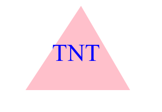
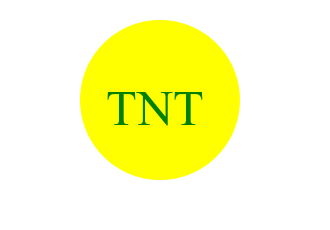

# SVG-logo-challenge
SVG-Logo- Challenge Module#10 Object Oriented Programming (OPP)

## Task
- Create a node program that returns a Logo in a SVG file using the user specified parameters collected from Inquirer Prompts.
- Use node and jest to create a testing suite for the js files.
- Use SVG viewer to preview the SVG files and view the actual Logo design.

## Process
- Create a Class and then duplicate that class in js that contains all the properties of the svg file.
- Build an index.js file, install npm inquirer@8.2.4, and run npm index.js to prompt the user for their desired text, text color, shape, and background colors.
- Run the class methods to return the svg file text, finally writing the file to a ".svg" file.
- Build a testing suite using node/jest in order to test part of the code. 
- Reveal the created svg file in Finder in order to see the logo's appearance.

## What I Learned
- How to build classes in js and extending these classes to make new ones.
- How to create a robust testing suite using jest.
- How to use node and different packages such as inquirer@8.2.4 and jest.
- What an svg file looks like, how to use svg syntax, and how to view it.
- How .gitignore file is used to keep a repository cleaned.

### Please view a Walkthrough Video here:
https://drive.google.com/file/d/1CU5z6TI0pa7jrz411CTDHYsem1T4Covz/view?usp=drive_link

## Screenshots of Logo designs

## Contact me
- [GitHub](https://github.com/mluron-ArxFjs)

- mluron2@gmail.com